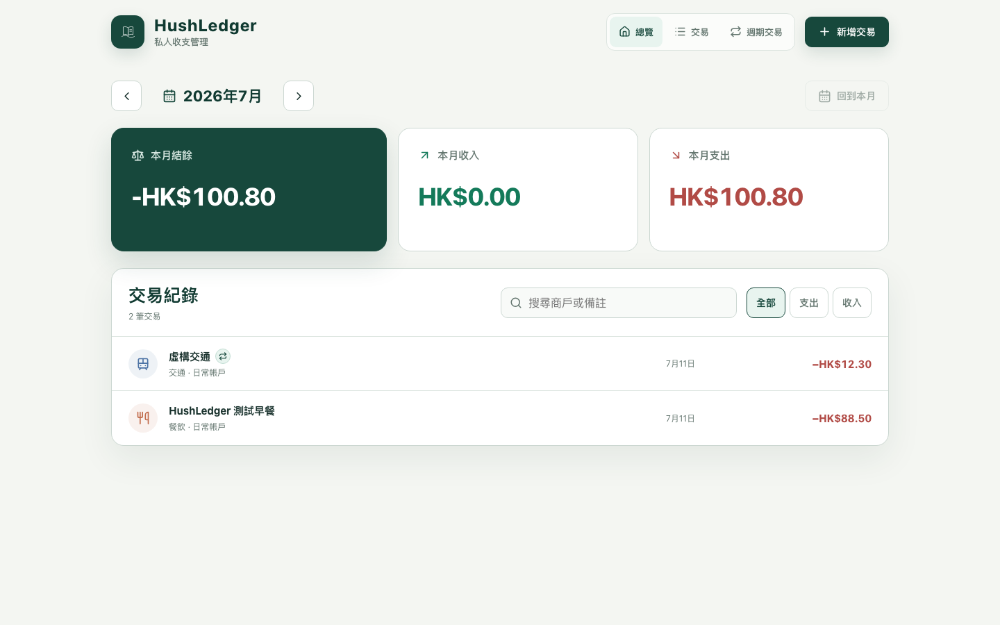

# HushLedger

> 一個安靜、可信、以私隱為先的私人收支 PWA。

[](https://github.com/Coke1120/HushLedger/actions/workflows/ci.yml)
[](LICENSE)
[](docs/CLOUDFLARE_SETUP.md)


HushLedger 是繁體中文、single-user、online-first 的私人收支管理工具。它使用
React PWA、Cloudflare Workers 與 D1，專注快速記帳、清楚的月份總覽，以及可靠
的每日／每週／每月週期交易。Production 必須由 Cloudflare Access 保護。

Open-source privacy-first personal finance PWA and expense tracker for Hong Kong,
with income tracking, recurring transactions, React, TypeScript, Cloudflare Workers
and D1.



## 已支援功能

- 月份收入、支出、結餘及最近交易。
- HKD 金額以 integer minor units 儲存，避免浮點數誤差。
- 每月最近 200 筆交易的搜尋，以及收入／支出篩選；到達上限時 UI 會明確標示。
- 自訂商戶／對象與備註。
- 每日、每週及每月週期交易：建立、修改、暫停、恢復及刪除。
- Cloudflare Cron 或手動產生到期交易；相同規則及日期不會重複建立。
- 月底錨點不漂移，例如 1 月 31 日會依次落在 2 月最後一日及 3 月 31 日。
- PWA app shell、手機 bottom sheet、tablet／desktop responsive layout。
- 明確的 loading、demo、offline、success 及 error 狀態。

目前帳戶及分類由 D1 seed 提供，包括現金、銀行、信用卡、電子錢包、收入及支出
分類。完整的自訂銀行／付款帳戶／收入及支出分類管理屬下一階段；現有 schema
已保留 soft-disable 與歷史 reference。詳見 [PROJECT_BRIEF.md](PROJECT_BRIEF.md)。
這裡的「付款」是付款方式帳戶（現金、銀行、信用卡或電子錢包），不是額外的
transaction type。

## 不變的資料規則

- 預設貨幣為 HKD。
- HK$123.45 以 `12345` 儲存在 `amount_minor`。
- 交易使用 client-generated UUID，安全重試不會建立重複資料。
- 交易只記錄香港曆日 `YYYY-MM-DD`，沒有 transaction time field。
- `created_at`／`updated_at` 是內部 UTC audit timestamps，不是使用者交易時間。
- 週期規則的 occurrence date 是 immutable idempotency key；修改只影響未產生的
  未來交易，暫停或刪除規則不會刪除歷史交易。
- 所有 API input 由 Zod 及 server-side account/category/type 規則再次驗證。

## 技術架構

```text
React 19 + Vite 8 + TypeScript PWA
                  │
                  ▼
       Cloudflare Worker + Hono
                  │
                  ▼
             Cloudflare D1
```

沒有獨立 database server、Docker database、第三方字型或 application-level login。
Cloudflare Access 是 production authentication boundary。

## 本機開始

需要 Node.js 22+ 及 npm 10+：

```bash
git clone https://github.com/Coke1120/HushLedger.git
cd HushLedger
npm ci
npm run db:local
```

分別啟動 Worker 及 Vite：

```bash
# Terminal A：Worker、API、local D1
npm run dev:worker
```

```bash
# Terminal B：Vite；/api proxy 至 127.0.0.1:8787
npm run dev
```

瀏覽 `http://localhost:5173`。只啟動 Vite 時會進入有清楚標示的展示模式；展示
資料只留在本次頁面。離線時 mutation 會被阻止，不會假裝已同步。

Production-like 單一 Worker 預覽：

```bash
npm run build
npm run dev:worker
```

再瀏覽 `http://localhost:8787`。

## 驗證

```bash
npm run db:local
npm run verify
npm audit --omit=dev --audit-level=high
```

`npm run verify` 依次執行 Vitest、TypeScript、ESLint、Oxlint、production PWA
build，以及使用隔離 temporary D1 的 Worker integration gate。Integration gate
會重做 fresh／upgrade migrations，並驗證 API、Cron、週期 CRUD、race-safe
idempotency 及歷史保留。Worker binding 改動後可執行：

```bash
npm run types:worker
```

## D1 migrations

| Migration | Purpose |
| --- | --- |
| `0001_schema.sql` | 初始 tables |
| `0002_seed.sql` | 初始 seed |
| `0003_phase1_hardening.sql` | constraints、indexes、UUID 交易及完整 seed |
| `0004_transaction_date_only.sql` | 把舊交易時間轉為香港曆日並移除 time field |
| `0005_recurring_rules.sql` | 週期規則、generation cursor 及 transaction provenance |

Local：

```bash
npx wrangler d1 migrations apply hushledger --local
```

Remote migrations 會改動正式資料。先確認 Cloudflare account、database 及備份，
再依 [Cloudflare deployment guide](docs/CLOUDFLARE_SETUP.md) 操作。

## API

成功回應為 `{ "ok": true, "data": ... }`；錯誤回應為
`{ "ok": false, "error": { "code", "message" } }`。

```text
GET    /api/health
GET    /api/accounts
GET    /api/categories
GET    /api/transactions?month=YYYY-MM&type=expense|income&search=...
POST   /api/transactions
GET    /api/summary?month=YYYY-MM

GET    /api/recurring-rules
GET    /api/recurring-rules/:id
POST   /api/recurring-rules
PUT    /api/recurring-rules/:id
PATCH  /api/recurring-rules/:id/status
DELETE /api/recurring-rules/:id
POST   /api/recurring-rules/run-due
```

交易列表按日期由新至舊，單次最多回傳 200 筆；到達上限時 UI 會顯示
`顯示最近 200 筆交易`，不會把截斷結果稱為全部。

Mutation routes 要求同源 browser request、JSON content type、body size limit 及
strict schema。這些 application checks 不取代 Cloudflare Access。

## Cloudflare 私人部署

[docs/CLOUDFLARE_SETUP.md](docs/CLOUDFLARE_SETUP.md) 提供完整操作，包括：

- Wrangler login 及 D1 建立／binding。
- Local 與 remote migrations。
- Worker deploy 及每日 00:05 HKT Cron。
- Cloudflare Access self-hosted application 及 alternate hostname 防護。
- 未授權／已授權 browser 驗證。
- 加密外部備份及 restore drill。
- 未來 AI provider secrets 的正確位置。

在 Access 完整保護 UI、`/api/*`、custom domain、`workers.dev` 與 preview URL 前，
不要輸入真實財務資料。

## AI 銀行紀錄匯入方向

核心功能穩定後，計畫支援貼上網上銀行純文字，由使用者提供的
OpenAI-compatible base URL／API key 解析為可修改草稿。AI 不會直接寫入 D1；
只有使用者逐筆確認後才會經 deterministic minor-unit pipeline 匯入。

完整 provider adapter、安全邊界、duplicate detection 及測試矩陣見
[AI_BANK_IMPORT_PLAN.md](AI_BANK_IMPORT_PLAN.md)。目前 release **尚未啟用 AI**，
也不接受 API key 進入 browser。

## 私隱與安全

- 不提交 `.dev.vars*`、`.env*`、`.wrangler/`、local SQLite、exports、backups、
  API keys 或真實財務資料。
- 不在 logs、screenshots、issues 或 PR 記錄完整金額、payee、note、銀行紀錄、
  account identifiers 或 request body。
- Worker secrets 使用 `wrangler secret put`；沒有 `VITE_` secret。
- 發現漏洞請依 [SECURITY.md](SECURITY.md) 私下回報。

## 參與

Issues 與 pull requests 歡迎。開始前請閱讀 [CONTRIBUTING.md](CONTRIBUTING.md)
及 [CODE_OF_CONDUCT.md](CODE_OF_CONDUCT.md)，並只使用虛構或已徹底匿名化的測試
資料。

## License

[MIT](LICENSE) © 2026 Coke1120
